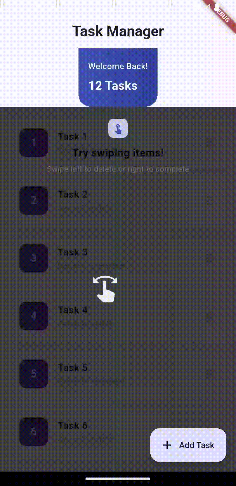

# Adding GIF Demonstrations

This document explains how to add the 6 GIF files to your flutter_feature_hint package.

## GIF Files Location

Place all GIF files in the `docs/gifs/` directory:

```
flutter_feature_hint/
└── docs/
    └── gifs/
        ├── swipe_left.gif
        ├── swipe_right.gif
        ├── swipe_up.gif
        ├── swipe_down.gif
        ├── tap.gif
        └── long_press.gif
```

## GIF Specifications

### Technical Requirements
- **Format**: Animated GIF
- **Dimensions**: 200×400 pixels (portrait orientation)
- **Duration**: 2-3 seconds per loop
- **File Size**: Optimize for web (keep under 5MB per file)
- **Frame Rate**: 10-15 FPS for smooth playback

### Content Requirements

Each GIF should demonstrate:

#### 1. swipe_left.gif
- Shows the overlay with full-screen semi-transparent background
- Animation icon at center performing a left-pointing gesture
- Text message displayed at top
- Duration: 2-3 seconds
- Clear left-to-right swiping motion

#### 2. swipe_right.gif
- Shows the overlay with full-screen semi-transparent background
- Animation icon at center performing a right-pointing gesture
- Text message displayed at top
- Duration: 2-3 seconds
- Clear right-to-left swiping motion

#### 3. swipe_up.gif
- Shows the overlay with full-screen semi-transparent background
- Animation icon at center performing an upward gesture
- Text message displayed at top
- Duration: 2-3 seconds
- Clear bottom-to-top swiping motion

#### 4. swipe_down.gif
- Shows the overlay with full-screen semi-transparent background
- Animation icon at center performing a downward gesture
- Text message displayed at top
- Duration: 2-3 seconds
- Clear top-to-bottom swiping motion

#### 5. tap.gif
- Shows the overlay with full-screen semi-transparent background
- Animation icon bouncing/tapping motion
- Text message displayed at top
- Duration: 2-3 seconds
- Quick tap motion repeated

#### 6. long_press.gif
- Shows the overlay with full-screen semi-transparent background
- Animation icon demonstrating hold/press motion
- Text message displayed at top
- Duration: 2-3 seconds
- Hand icon held down, then released

## How to Create GIFs

### Option 1: From Flutter App Screenshots
1. Run the example app with the feature hint
2. Record a video of each gesture (2-3 seconds)
3. Convert video to GIF:
   ```bash
   # Using ffmpeg
   ffmpeg -i video.mov -vf "fps=10,scale=200:400:flags=lanczos" -loop 0 output.gif
   ```

### Option 2: Using Online Tools
1. Create animations or screenshots showing each gesture
2. Use an online GIF maker like:
   - ezgif.com (free, web-based)
   - gifmaker.me
   - imgflip.com

### Option 3: Screen Recording
1. Run the example app
2. Screen record using QuickTime (macOS) or equivalent
3. Crop to 200×400 pixels
4. Convert using FFmpeg or online tool

## Optimizing GIF Files

### Using FFmpeg
```bash
# High quality, optimized for web
ffmpeg -i input.mov -vf "fps=12,scale=200:400:flags=lanczos" -loop 0 output.gif

# Further optimize file size
ffmpeg -i output.gif -vf "split[s0][s1];[s0]palettegen[p];[s1][p]paletteuse" output_optimized.gif
```

### Using imagemagick
```bash
convert -resize 200x400 -colors 256 -depth 8 input.gif output.gif
```

### Online Optimization
- Use ezgif.com's optimize tool
- Usually reduces file size by 30-50% with minimal quality loss

## Testing the GIFs

1. After adding GIF files, the README.md will display them in a table
2. Test locally by opening README.md in a markdown viewer
3. Verify GIFs appear in:
   - Local markdown preview
   - GitHub web interface
   - pub.dev package page

## GIF Display in README

The README.md has a pre-configured table that displays your GIFs:

```markdown
<table>
  <tr>
    <td align="center">
      
      <br><b>Swipe Left</b>
    </td>
    ...
</table>
```

The images will automatically appear once files are committed.

## Git Tracking GIFs

To track GIF files with Git:

```bash
# Add GIF files
cd /Users/abhijithksabu/vensure/projects/personal/flutter_feature_hint
git add docs/gifs/

# Commit
git commit -m "Add gesture demonstration GIFs"
```

Note: If GIFs are large, consider:
- Using Git LFS (Large File Storage)
- Optimizing file sizes further
- Using external hosting service

## Troubleshooting

### GIFs Not Showing on GitHub
- Check file paths are relative: `docs/gifs/filename.gif`
- Ensure GIF files are in the correct directory
- Push changes: `git push origin main`
- GitHub may take a few minutes to display images

### GIFs Not Showing on pub.dev
- pub.dev displays files relative to package root
- Path should be: `docs/gifs/filename.gif`
- Files must be tracked in git
- Ensure files are included in package

### File Size Too Large
- Reduce dimensions or frame rate
- Use optimization tools
- Consider GIF compression
- Aim for under 2MB per file

## Support Resources

- ezgif.com - GIF creation and optimization
- FFmpeg documentation - Video/GIF conversion
- GitHub markdown guide - Image embedding
- pub.dev documentation - Asset hosting

---

Once you add these 6 GIF files, your package will be visually demonstrated in:
- README.md (local and GitHub)
- pub.dev package page
- GitHub repository

This significantly improves the quality and user understanding of your package!
